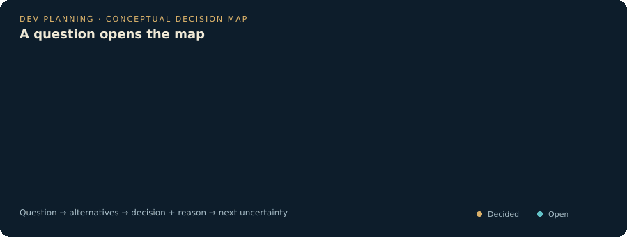
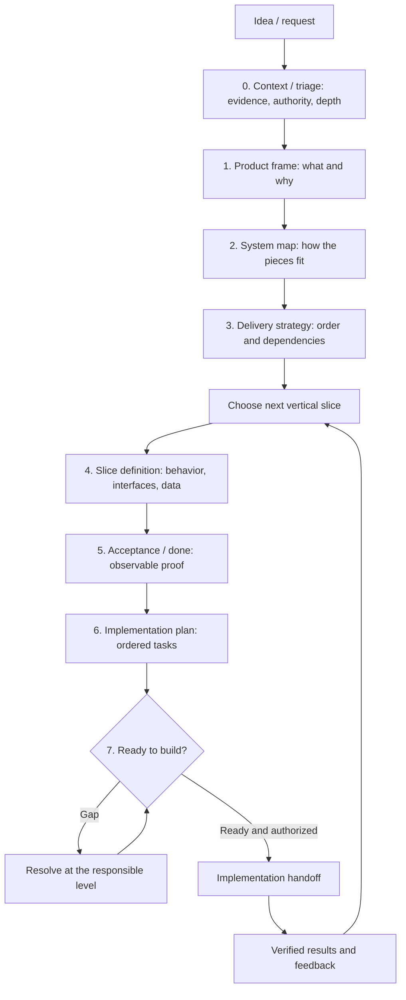

# Dev Planning

**Plan the route before you build.**

Agent skills for planning full-stack products before implementation.

The goal is to help a person or agent decide **which planning areas to cover, which planning modules are needed within each area, in what order, and at what depth**. Start from a product idea or an existing application, and leave the next vertical slice sufficiently defined for an implementation agent to build and verify it.

**Status: 0.2.0 draft.** The repository currently contains one coordinating skill and three supporting references. Structure and links are validated. An independent desk review has covered the entry points; agent execution against realistic projects remains an open evaluation task. This is an evolving method, and contributions should bring concrete scenarios and evidence.

## A map of decisions

Planning connects questions, alternatives, evidence, and decisions. Keep the chosen route, its reason, and the next uncertainty visible.

<picture>
  <source media="(prefers-reduced-motion: reduce)" srcset="docs/assets/decision-map.svg">
  
</picture>

[View the static map](docs/assets/decision-map.svg).

This schematic illustrates the visual direction. A live HTML map with node-linked review is planned; it is not yet implemented in the published skill.

## Try it

Copy the entire [`skills/dev-planning`](skills/dev-planning) directory into your agent's configured skills directory. Keep `SKILL.md`, `references/`, and the included `LICENSE` together. Follow your runtime's skill discovery instructions; runtime-specific installation and automatic activation have not been tested here.

Start with a request such as:

> Use dev-planning to plan a new web application for booking appointments. Identify unresolved product decisions, map the system, choose the first slice, and prepare its acceptance criteria and implementation tasks.

Or:

> Use dev-planning to add team invitations to this existing application. Inspect the current roles, data model, and delivery process. Inherit valid decisions and plan the affected slice.

Provide the request and available project evidence. The skill distinguishes a discussion, a saved plan, tracker publication, and authorized implementation. A ready plan does not grant permission to build, merge, or deploy.

## Four separate decisions

| Concept | Question | Example |
| --- | --- | --- |
| Planning level | Which decision depends on which earlier decision? | Product frame before selecting a delivery slice |
| Planning area | Which aspects of the product or system could affect this work? | UX, data, security, operations |
| Planning module | Which reusable procedure resolves an applicable decision? | Define permissions, design an API contract, plan a migration |
| Planning depth | How much evidence and detail does this decision need? | Lite, Standard, Deep |

A **planning module** is a procedure with an activation rule, inputs, output, and completion condition. An **application module** is a domain or technical component of the product. Keep those meanings distinct when contributing.

There is no fixed module count per area. Select the smallest set of procedures that covers the applicable decisions and risks. Reuse current evidence; detail uncertain or expensive-to-reverse decisions; defer future decisions with a reason and a trigger for revisiting them.

The current skill routes by levels and coverage areas. A named module catalog with explicit dependencies is a proposed next step, tracked in [issue #2](https://github.com/Sergio-CVM00/dev-planning/issues/2).

## Planning sequence



The sequence expresses dependencies, not a requirement to write a full PRD for every change. Refine adjacent levels together when they expose a conflict.

| Starting point | Approach |
| --- | --- |
| New product | Establish product frame, system map, and delivery strategy; detail the first slice |
| Existing feature | Check the impact on global decisions, inherit valid evidence, and detail the affected slice |
| Bug | Establish observed and expected behavior, reproduce when possible, and plan a bounded correction |
| Migration | Define current and target states, compatibility, transition, validation, and recovery |

Read the [skill entrypoint](skills/dev-planning/SKILL.md) for the workflow, [planning levels](skills/dev-planning/references/planning-levels.md) for level details and change entry points, and [planning outputs](skills/dev-planning/references/planning-outputs.md) when preparing a handoff.

## Coverage and depth

Review [full-stack coverage](skills/dev-planning/references/full-stack-coverage.md) during triage. It covers product/UX/content, domain/backend/contracts, data/migrations, security/privacy, performance/reliability/integrations, infrastructure/delivery/operations, research/feasibility, and coordination/traceability. Add domain-specific requirements when they affect the decision.

Give each area a disposition: **Detail now**, **Inherited**, **Deferred**, or **Not applicable**, with evidence or rationale. Areas may require work at several planning levels.

Choose depth from ambiguity, impact, reversibility, and coordination:

- **Lite:** bounded work with known behavior and reusable decisions.
- **Standard:** a meaningful feature or change that needs affected boundaries, contracts, acceptance, and delivery specified.
- **Deep:** uncertain feasibility, global choices, significant coordination, or consequential transitions.

A small change can require Deep planning. A new product can reuse known technology while still needing its own product frame.

The output is a plan for the next slice with evidence, acceptance criteria, ordered tasks, open decisions, and one status: **READY TO BUILD**, **NEEDS DECISION**, or **BLOCKED**. Keep implementation authority separate.

## Contribute

Start with a scenario that the current workflow handles poorly. Propose a focused correction or a module whose trigger, dependencies, output, and completion condition are clear.

See [CONTRIBUTING.md](CONTRIBUTING.md), the [evaluation guide](docs/evaluation.md), and the [open issues](https://github.com/Sergio-CVM00/dev-planning/issues). Contributions can improve the method, clarify routing, document a case, or add a module. A separate skill is useful when it can be invoked independently; conditional detail can remain a reference.

Run the repository checks with Python 3.11 or newer:

```sh
python3 scripts/validate.py
```

These checks validate the repository's limited metadata format and local Markdown file links. They do not evaluate planning quality or prove that an agent follows the method.

## License and authoring influence

[MIT](LICENSE).

The instructions were written with the principles in Matt Pocock's [writing-for-agents](https://github.com/mattpocock/skills/tree/main/skills/productivity/writing-for-agents): progressive disclosure, precise context pointers, and checkable completion conditions.
